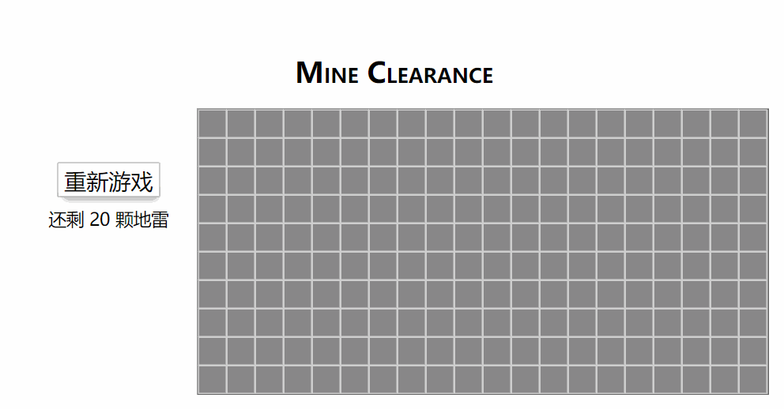

# Mine Clearance（扫雷）

该游戏使用**原生 JavaScript** 的 **ECMAScript 6** 语法标准开发的游戏框架 **JSGame** 完成

JSGame 的**核心原理**是通过**定时器**定义一个**游戏帧率**，在每一帧里都会依次执行 **debug**、 **update** 和 **draw** 这些生命周期函数，销毁时调用 **destroy**，这样不用每次手动去更新和绘制视图页面，**将逻辑和视图分离出来**。

- 实现了**框架的生命周期**，父模块调用子模块的相应的生命周期函数
- 实现了**游戏场景的抽象**，实现游戏随时切换场景
- 实现了**游戏资源的预加载**，提高游戏体验
- 实现了**双向绑定机制**，能够在游戏运行期间修改参数，提高调试效率
- 实现了**事件绑定的统一化管理**，实现模块销毁时，自动注销事件
- 支持**配置式管理**，可配置预加载资源以及调试参数，提高开发和调试效率

> [在线地址](http://106.53.84.52/game/mine-clearance/)
>
> TIP：由于部署项目用的是学生优惠的腾讯云，上传带宽只有 1M，所以游戏加载会有些卡顿

## 游戏预览

## 实现功能

- 开局的第一个格子四周无地雷（避免开局杀）
- 递归展开四周地雷为0的格子
- 提示剩余地雷数
- 点击已展开的格子能够检测周围格子情况

## 扫雷的实现过程
1. 形成地图
   扫雷的核心是通过格子的数字提示了附近 **8** 个格子的地雷数目
   一个格子如果附近 **8** 个格子都为地雷，那该格子数字为 **8**
   所以我们可以用数字 **9** 来代替地雷（只要是非 **0** 到 **8** 的数都行）
   然后在一个 **m x n** 的空数组里随机几个坐标赋值为 **9** （放置地雷）
   接着我们对这一数组进行标记，计算出每个格子附近的地雷数
   标记的算法是：通过两重循环遍历这个数组，当遇到地雷时，
   把这个地雷附近 **8** 个格子的数目加 **1**，注意要处理边缘情况。
   这样就形成了地图
2. 当点击没显示格子时，递归展开附近的格子
   扫雷点开格子的规则是：
   - 若点击的是 **1** 到 **8** ，则只显示这个格子
   - 若点击到地雷，则游戏结束
   - 若点击到 **0**，则显示这个格子外，同时递归展开附近 **8** 个格子
     - 递归展开过程中，若遇到 **0** ，则继续以这个格子为基准，递归展开附近 **8** 个格子
     - 若遇到 **1** 到 **8**，则只显示该格子，停止递归
     - 若遇到已经显示的格子，停止递归
     - 若遇到地雷，停止递归
     - 若遇到地图边缘，停止递归
